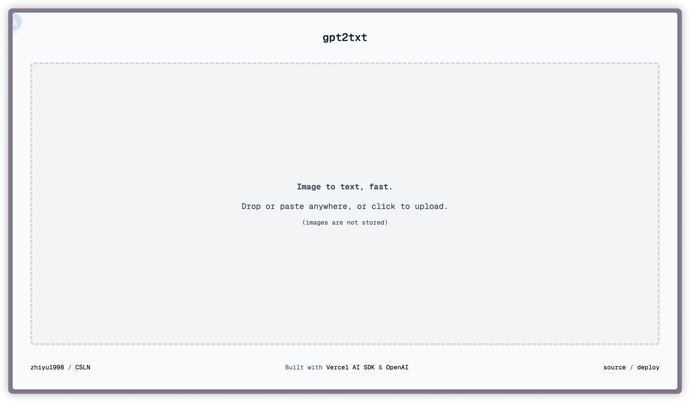

# gpt2txt

[English](./README.md) | 中文

使用gpt将图像转换为文本，速度快。 使用[Vercel AI SDK](https://sdk.vercel.ai)、[Claude](https://claude.ai/)和[Next.js](https://nextjs.org)构建。

## 开发

- 使用`git`克隆存储库

- 创建一个名为`.env.local`文件，并添加 `OPENAI_API_KEY = your-api-key`、` OPENAI_BASE_URL = your-base-url `和` OPENAI_MODEL = your-like-model `其中`your-api-key`是来自[OpenAPI Platform](https：//platform.openai.com/api-keys)的您的OpenAPI API密钥

- 运行`yarn`以安装依赖项

- 运行`yarn dev`启动开发服务器

## 致谢

感谢由 ai-ng 创建的框架，因为购买 Claude 的 API 不是不方便，所以构建了`gpt2txt`：

- [2txt: Image to text, fast.](https://github.com/ai-ng/2txt)